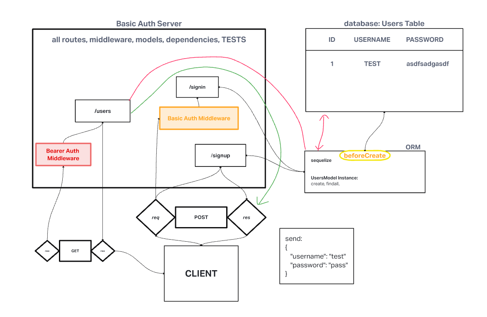

# auth-final
lab 09

## Author: Junyoung Son , KC Hofstetter

## Problem Domain:
  Create a bearer auth server to practice basic auth, use of middleware, routes, and all CRUD functionality.  

## Dependencies:

    "base-64": "^1.0.0",
    "bcrypt": "^5.0.0",
    "cors": "^2.8.5",
    "dotenv": "^8.2.0",
    "eslint": "^7.14.0",
    "express": "^4.17.1",
    "jest": "^26.6.3",
    "jsonwebtoken": "^8.5.1",
    "morgan": "^1.10.0",
    "pg": "^8.6.0",
    "sequelize": "^6.6.2",
    "sequelize-cli": "^6.2.0",
    "sqlite3": "^5.0.2",
    "supertest": "^6.0.1"

## 